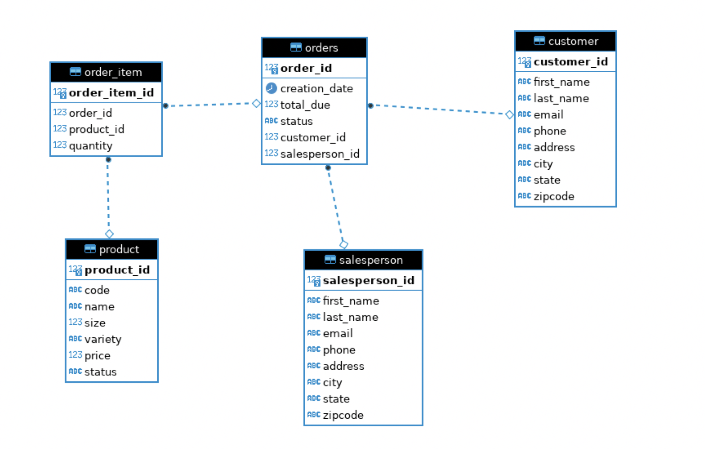

# Introduction

The JDBC application is a  program designed to manage a relational database of commercial website.
The app communicates with the database and executes SQL queries against it. It implements the CRUD pattern to create, read, update and delete data such as customer data and orders made by customers.
We used Java to construct the app, PostgreSQL as a Relational database manager.  We implemented the JDBC to communicate with the database.  We used Maven for the standard directory layout. 

# Implementaiton
## ER Diagram

## Design Patterns

The app implements the  DAO (Data access object) pattern. The DAO is a structural pattern that allows us to isolate the application/business layer from the persistence layer ( in this case it's the database ) using abstract API .
By mapping application calls to the database, the DAO provides some specific data operations without exposing details of the database. The DAO contains the Create, Read, Update and Delete operations.
The app has also a DTO ( Data Transfer Object) that will be used to pass value object to DAO and the DAO will use this object to persist data using its CRUD operation.
The app has two Data access objects: customerDAO and OrderDAO . Both are used to persist Customer and Order data into the database respectively without exposing the SQL queries.
For the simplicity of the app, we didn't implement the Repository pattern. The pattern is a repository of a specific type of objects - it allows to search for a specific type of objects as well as store them.

# Test

The app was tested manually. We used IDE to debug CRUD operations and fix issues and we used another PSQL instance on the terminal to examine the effects on the database. 
