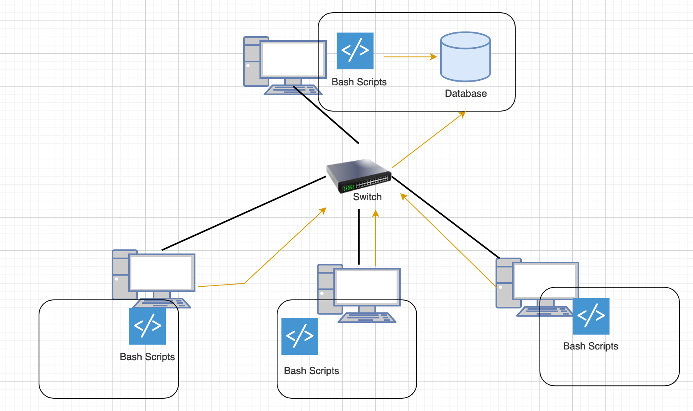

# Introduction

The Jarvis Linux Cluster Administration (LCA)  program is a monitoring tool used to continuously record essential resource usage data as well as hardware 
specifications. The collected data is stored in a database and it will be used for future data analytics .

The program is used by LCA team members and it is installed on a server cluster that runs Centos  OS .

The Linux cluster is connected through a switch and each node runs the monitoring tool sends the data via the local network automatically.

We used bash scripts to collect the usage data and hardware specifications.

We used Postegre as our RDBMS . The latter is deployed on a Docker instance.

# Quick Start

- Start a psql instance by running  psql_docker.sh

 `$ ./scripts/psql_docker.sh start|stop|create [db_username][db_password]`

- Create tables using ddl.sql

`$ psql -h -U -d -f .sql/ddl.sql`

- Insert hardware specs data into the DB using host_info.sh

`$ ./scripts/host_info.sh psql_host psql_port db_name psql_user psql_password`

- Insert hardware usage data into the DB using host_usage.sh

`$ ./scripts/host_usage.sh psql_host psql_port db_name psql_user psql_password`

- Crontab setup

`$ crontab -e`

 `* * * * * bash ./scripts/host_usage.sh psql_host psql_port db_name psql_user psql_password > /tmp/host_usage.log`

# Implementation

To run the program, the user must have:

- docker installed in the host machine .

- Postgre image deployed .

1) Create the database  :`./scripts/psql_docker.sh create db_username db_password`

Start the  container : `./scripts/psql_docker.sh start`

Create  the tables and insert sample data  by executing the following command :

 `psql -h localhost -U postgres -d host_agent -f sql/ddl.sql`

run the host infos script to get host specs : `bash scripts/host_ìnfo.sh psql_host psql_port db_name psql_user psql_password`

and finally run the host_usage script the collect the host usage data :

`bash scripts/host_usage.sh psql_host psql_port db_name psql_user psql_password`

The user can also run useful queries that help in managing the cluster

better by executing the `queries.sql`

## Architecture

## Scripts

### psql_docker.sh

The script is used to create a new Psql docker instance with a given username and password .

    

$ ./scripts/psql_docker.sh create db_username db_password

To  start docker container :

$ ./scripts/psql_docker.sh start

To stop a docker container :

$ ./scripts/psql_docker.sh stop

### host_info.sh

it's used to collect hardware specification data and persist it on the database.

   

$ ./scripts/host_info.sh psql_host psql_port db_name psql_user psql_password

### host_usage.sh

It's used to collect host usage data resources and persist it on the database .

$ ./scripts/host_usage.sh psql_host psql_port db_name psql_user psql_password

### ddl.sql

Used to create PSQL database and tables .

$ psql -h -U -d -f .sql/ddl.sql

    

### crontab

The crontab command runs the `host_usage.sh` script every minute to store real time usage data continuously.

edit crontab

$ crontab -e

`add this to crontab`

`* * * * * bash /home/centos/dev/jrvs/bootcamp/linux_sql/host_agent/scripts/host_usage.sh localhost 5432 host_agent postgres password > /tmp/host_usage.log`

  

    

### queries.sql

The file is used to get useful data from database so that LCA team can manage the cluster better and also plan for future actions .

It has 3 queries :

1) Group hosts by CPU number and sort by their memory size in descending order

2) Get average used memory in percentage over 5 mins interval for each host.

3) Returning the list of failed nodes.

## Database Modeling
There are two tables in the PSQL database, their schema are outlined below
- `host_info`

  | Column           | Data type     | Description            |
  |---------------|:-----------------------| -----|
  | id               | SERIAL        | Primary key            |
  | hostname         | VARCHAR       | host system name       |
  | cpu_number       | VARCHAR       | Number of CPUs         |
  | cpu_architecture | VARCHAR       | CPU architecture       |
  | cpu_model        | VARCHAR       | Model of CPU           |
  | cpu_mhz          | VARCHAR       | CPU clock speed (MHz)  |
  | l2_cache         | VARCHAR       | L2 cache  size (MB)    |
  | total_mem        | VARCHAR       | Total  memory (MB)     |
  | timestamp        | TIMESTAMP     | Timestamp (UTC) |

- `host_usage`

  | Column           | Data type | Description                        |
    |-----------|:-----------------------------------| -----|
  | timestamp        | TIMESTAMP | Timestamp of data in UTC time      |
  | host_id          | VARCHAR   | Foreign key that refers to host_id |
  | memory_free      | VARCHAR   | Free memory (MB)                   |
  | cpu_idle         | VARCHAR   | Cpu idle not used(%)               |
  | cpu_kernel       | VARCHAR   | Cpu kernel not used (%)            |
  | disk_io          | VARCHAR   | Number of disks I/O                |
  | disk_available   | VARCHAR   | disk available (MB)                |

# Test

The bash scripts are all tested on the centos os 7 terminal .

Queries were tested on the Postgre database .

# Improvements

1. Including the ability to obtain a list of software processes using resources usage.

2. A script to obtain network statistics such as IP addresses and network type.

3.List of connected external connections and local sockets.

4.Query to list the most consumed nodes in the cluster.

5.Query to list hosts that have certain software installed .

6.A function that returns a table containing usage esource data for a specific host in the past 24 hours.

7.Automating scripts to start and stop at specific times.
